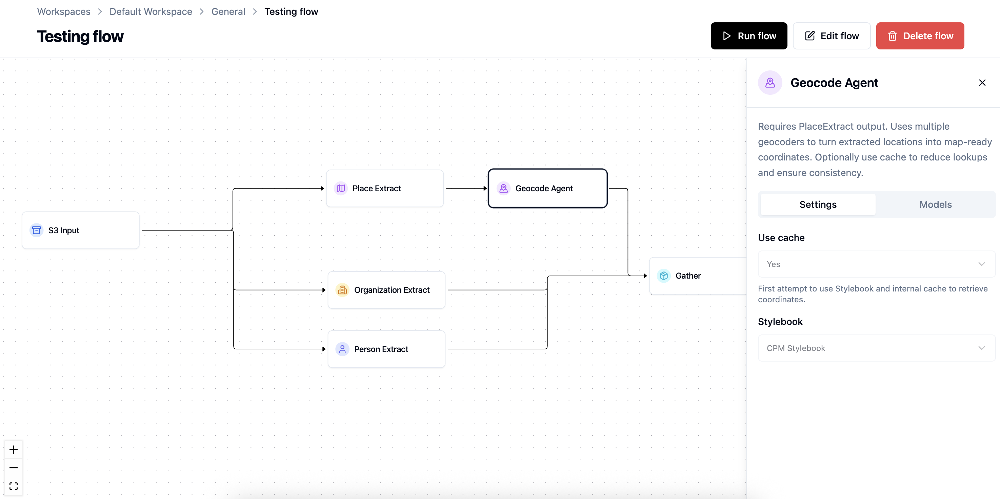
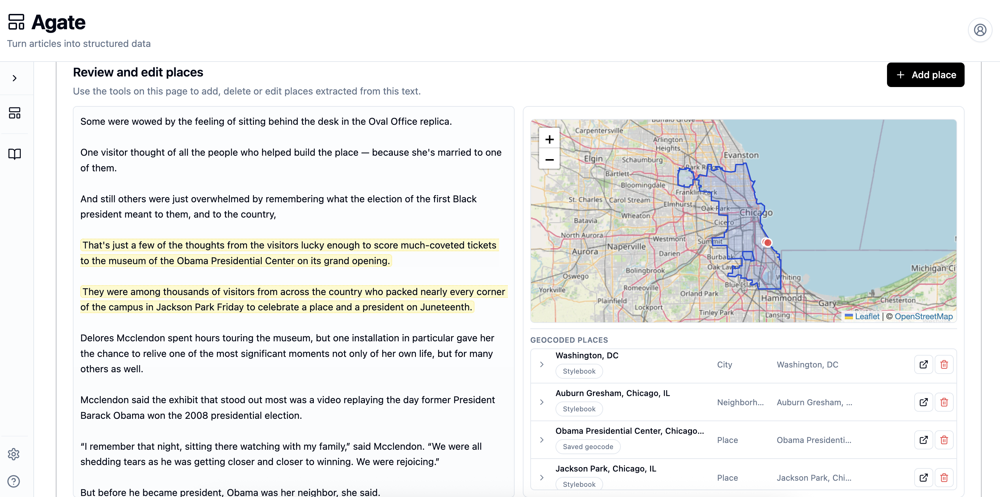
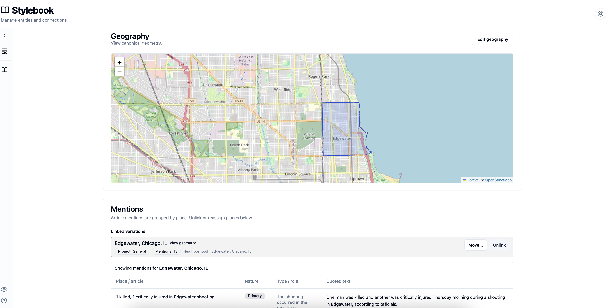

# Backfield

> **Turn journalism into durable, structured knowledge**

Backfield turns unstructured news stories into structured data at scale. Among other things, it extracts and geocodes the locations of news events; organizes people and their quotes; and connect people, places and organizations into a knowledge graph based on your coverage.

It applies journalistically useful metadata, including subjects, topics, story formats and user needs, and embeds articles so they can be searched by meaning in addition to keywords. It also allows for the extraction of custom data (think: recipes, obituaries, restaurants and things-to-do lists) that can be used to create new products and display articles in new ways.

It does all this with an awareness of the standards and traditions of journalism, taking into account newswriting style and structure, as well as norms around editorial importance and accuracy. All of this takes place within an interface that allows users to customize the system for their organization's specific use cases — and exposes data for user-friendly editorial review. 

Backfield was built from the premise that structured journalism, at scale, can open new opportunities to build new products and services, understand how our coverage resonates with audiences, and transact in the burgeoning AI ecosystem.

It is a product of [Local Angle.](https://localangle.co)

## Use cases

Structured data generated by Backfield has been used for a variety of production applications, experiments and prototypes. Here are several examples:

- Creating **geographically targeted news feeds** that surface parts of articles relevant to readers in different cities and neighborhoods. If your neighborhood coffee shop is mentioned in paragraph 20 of a long story, you'll see it.
- Annotating articles with **useful taxonomies**, such as user needs and story formats, for the purpose of enriching analytics.
- Building **knowledge graphs** from years of news archives, which can be used to power sophisticated and explainable AI search systems. 
- Pulling apart narrative stories, such as **recipes and obituaries**, into structured data for the purposes of building new products and story forms.
- **Mapping a newsroom's coverage geographically**, auditing sources, and otherwise providing a high-level view of community coverage.
- Creating dashboards for **fund-raising and ad sales** that show how coverage touches on issues, geographies or institutions potential funders might care about.

And more. If you have ideas for other opportunities structured journalism might present at your organization, [reach out](https://localangle.co).

## The platform

Backfield is currently three interconnected applications:

### Agate

Agate is a tool for creating composable data extraction and enrichment workflows. It takes articles and transforms them into structured data that can either be output as JSON or persisted into the Backfield application ecosystem. Users construct workflows from a series of nodes that are designed to extract or enrich specific pieces of information. These nodes can be customized as needed, and new ones can be created by developers.



Agate also contains a review interface where users can make corrections — or manually extract and annotate data themselves.



### Stylebook

Stylebook is tool for cleaning, standardizing and enriching entities that are extracted by Agate — specifically people, places and organizations. 

In coverage, a given entity might be referred to in multiple ways. For instance, Cardinal Robert Prevost and Pope Leo XIV refer to the same person. Stylebook allows us to unify those instances into a single canonical person. This allows us to do things like reliably retrieve all stories featuring a given person, place or organization. Cleaning data in this way also ensures future extractions are more useful and accurate.

Most of this cleanup work happens automatically with help from large language models.

Canonical Stylebook entities can also be enriched with metadata and connected to each other. A politician can be assigned a party; a neighborhood can be assigned demographic information. This allows us to query our articles in all kinds of interesting ways — for example, show all quotes by Democrats about an issue, or show how we have covered immigration in predominantly Hispanic neighborhoods.



### Public API

Backfield's public API allows users to query the extracted and enriched data in a variety of ways, including by location and entity, by keyword or semantically. This API can be used to power products, services, tools and story forms based on the structured information that Backfield curates.

The Backfield ecosystem continues to evolve, and more applications will be made available as they are launched.

## Quickstart

Follow these instructions to get up and running locally.

### What you need

- Python 3.11
- [Docker Engine](https://docs.docker.com/engine/) with [Compose v2](https://docs.docker.com/compose/) (Docker Desktop on macOS/Windows is fine)
- [uv](https://docs.astral.sh/uv/) for Python dependencies
- [Node.js 20](https://nodejs.org/) for UI builds and frontend checks outside Docker
- Git


### Launch Backfield locally

```bash
git clone https://github.com/localangle/backfield.git
cd backfield
make bootstrap
source .venv/bin/activate
backfield init
```

`backfield init` guides you through local setup, creates the development environment, starts the services, runs database migrations, and seeds a local administrator.

Once that is done:

1. Open [Agate](http://localhost:5173) and sign in with the administrator you just created.
2. Go to **Settings → AI models** and configure credentials for the models and integrations your flows will use.
3. Follow Local development setup for stack commands, data lifecycle, and troubleshooting links.


| App           | Local address                           | Use it for                                   |
| ------------- | --------------------------------------- | -------------------------------------------- |
| **Agate**     | [localhost:5173](http://localhost:5173) | Building flows and reviewing article results |
| **Stylebook** | [localhost:5175](http://localhost:5175) | Browsing and curating canonical records      |


Published ports bind to `127.0.0.1` only.

## External services and dependencies

For optimal performance, Backfield relies on several external services and APIs to extract and enrich data. To get the most from the platform, you'll want to obtain the following API keys, which can be entered in the Backfield interface under Settings/Integrations.

- **Your LLMs of choice**: Backfield supports any model in the [LiteLLM ecosystem](https://models.litellm.ai/).
- **[Geocode Earth](https://geocode.earth/):** A great geocoder, based on open source technology, with permissive data retention rules. Has a generous free tier.
- **[Geocodio](https://www.geocod.io/)**: Another permissive geocoder that is used as a fallback and for some special geocoding cases. Also comes with a free tier. For both geocoders, [Nominatim](https://nominatim.org/) is used as a fallback.
- **[Brave Search API](https://brave.com/search/api/)**: Used to look up details that enhance the accuracy of geocoding. No free tier, but Duck Duck Go is used as a fallback and is free.
- **[AWS S3](https://aws.amazon.com/pm/serv-s3)**: Used for S3 Input and Output

All of these services are optional, but they greatly enhance performance.

## Project status

This repository is open for **local development, source inspection, and external contributions**.

Production self-hosting is not directly supported from this checkout. You can deploy Backfield publicly, but infrastructure, image builds and other infrastructure are not supplied in this repo.

Further guidance on this is forthcoming, and you can contact [Local Angle](https://localangle.co) for help getting things running.

## For contributors

External contributions are welcome. Start with [CONTRIBUTING.md](CONTRIBUTING.md) for setup, validation, and pull-request expectations. [AGENTS.md](AGENTS.md) is the engineering/agent conventions guide (repo map, commands, style, and validation defaults). Use `make lint` and `make test` before submitting changes.

## License

Copyright 2026 Local Angle

Licensed under the Apache License, Version 2.0 (the "License"); you may not use this
software except in compliance with the License. You may obtain a copy of the License
in [LICENSE.md](LICENSE.md) or at [apache.org/licenses/LICENSE-2.0](http://www.apache.org/licenses/LICENSE-2.0).

## Support

Questions about local development or contributions? Reach out to [Local Angle.](https://localangle.co)