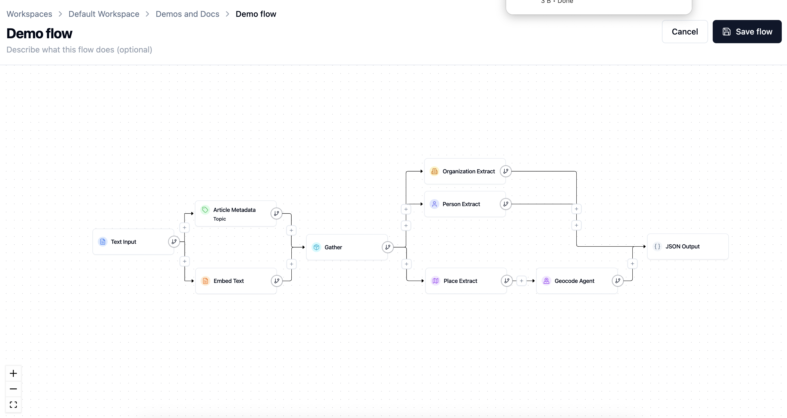
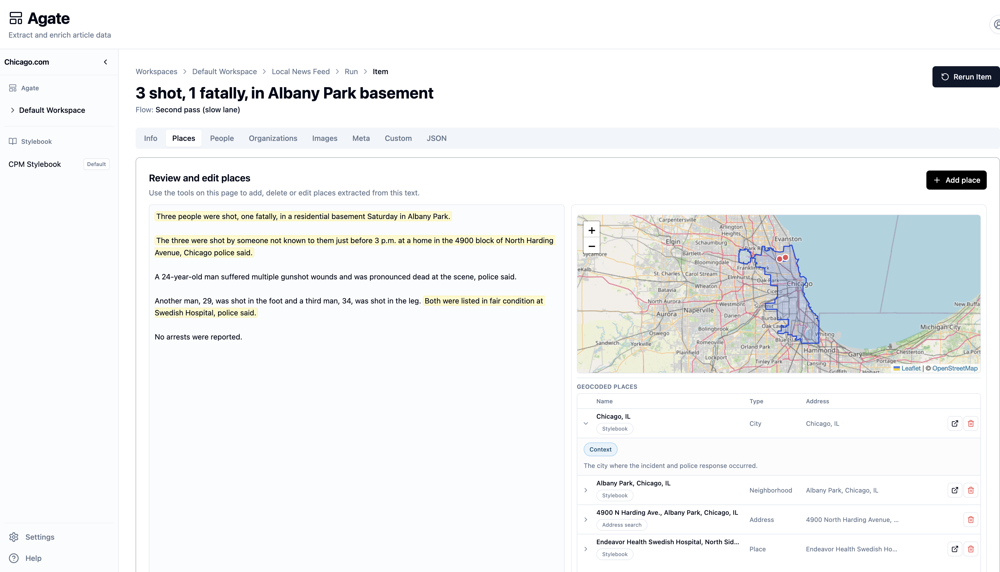

# Backfield

> **Turn the reporting you publish into knowledge you can use.**

Backfield helps newsrooms turn unstructured stories into organized, reusable editorial data. It finds the people, places, organizations, and other facts in an article; gives editors a clear place to review the results; and connects approved records across the organization’s coverage.

It is built for the work that happens after publication: understanding who and what your newsroom has covered, correcting the record, and building a reliable foundation for future reporting.

<p align="center">
  
</p>

## Project status

This repository is open for **local development, source inspection, and external contributions**.

**Production self-hosting is not supported** from this checkout. The Compose stack and CLI target a localhost development environment. Artifact builds (OCI images and UI archives) may be published by CI for a separate deployment system; that path is not an in-repo, supported self-hosting guide.

See [CONTRIBUTING.md](CONTRIBUTING.md) for how to contribute, and [SECURITY.md](SECURITY.md) for private vulnerability reporting.

## What you can do with Backfield

| | |
| --- | --- |
| **Build repeatable editorial workflows** | Use a visual flow builder to decide what to extract or enrich from one story or a whole batch. |
| **Review results with source context** | See every result alongside the passage that produced it, then correct, remove, or add information before it becomes part of your record. |
| **Maintain a shared Stylebook** | Bring mentions of the same person, place, or organization together in a canonical record that grows with your coverage. |
| **Make your coverage usable** | Keep structured results available for editorial tools, analysis, and the public API. |

## How it fits together

```text
Stories  →  Agate flows  →  Editor review  →  Stylebook  →  Reusable data
```

- **Agate** is the workspace for building flows, processing articles, and reviewing the results.
- **Stylebook** is the shared record of the people, places, and organizations that matter to your coverage.
- **The public API** makes approved, structured data available to products and reporting tools.

The goal is not to replace editorial judgment. Backfield makes automated extraction useful by keeping people in control of the results.

<p align="center">
  
</p>

## Start locally

### What you need

- Python 3.11
- [Docker Engine](https://docs.docker.com/engine/) with [Compose v2](https://docs.docker.com/compose/) (Docker Desktop on macOS/Windows is fine)
- [uv](https://docs.astral.sh/uv/) for Python dependencies
- [Node.js 20](https://nodejs.org/) for UI builds and frontend checks outside Docker
- Git

### Get running

```bash
git clone https://github.com/localangle/backfield.git
cd backfield
make bootstrap
source .venv/bin/activate
backfield init
backfield doctor
```

`backfield init` guides you through local setup, creates the development environment, starts the services, runs database migrations, and seeds a local administrator. Run `backfield doctor` afterward to verify the host, virtualenv, and configuration. When setup finishes:

1. Open [Agate](http://localhost:5173) and sign in with the administrator you just created.
2. Go to **Settings → AI models** and configure credentials for the models your flows will use.
3. Follow [Local development setup](docs/development/local-setup.md) for stack commands, data lifecycle, and troubleshooting links.

| App | Local address | Use it for |
| --- | --- | --- |
| **Agate** | [localhost:5173](http://localhost:5173) | Building flows and reviewing article results |
| **Stylebook** | [localhost:5175](http://localhost:5175) | Browsing and curating shared records |

Published ports bind to `127.0.0.1` only.

> **Already set up?** Run `backfield up` to start the stack, `backfield logs` to follow service logs, and `backfield down` when you are done. `make up`, `make logs`, and `make down` provide the same shortcuts. `make down` stops this project’s Compose stack; it does **not** prune Docker globally. Use `make docker-trim` only when you opt into host-wide cleanup.

## Learn more

- [A five-step example: from a story to reusable data](https://docs.backfield.news/platform/simple-example/)
- [Agate flows and processing](https://docs.backfield.news/platform/agate/)
- [Stylebook and canonical records](https://docs.backfield.news/platform/stylebook/)
- [Public API guide](docs/api/public.md)
- [Architecture](docs/architecture/overview.md)
- [Repository documentation](docs/README.md)
- [All documentation](https://docs.backfield.news)

## For contributors

External contributions are welcome. Start with [CONTRIBUTING.md](CONTRIBUTING.md) for setup, validation, and pull-request expectations. [AGENTS.md](AGENTS.md) is the engineering/agent conventions guide (repo map, commands, style, and validation defaults). Use `make lint` and `make test` before submitting changes.

## License

Copyright 2026 Local Angle

Licensed under the Apache License, Version 2.0 (the "License"); you may not use this
software except in compliance with the License. You may obtain a copy of the License
in [LICENSE.md](LICENSE.md) or at
[apache.org/licenses/LICENSE-2.0](http://www.apache.org/licenses/LICENSE-2.0).

## Support

Questions about local development or contributions? See [CONTRIBUTING.md](CONTRIBUTING.md),
[docs.backfield.news](https://docs.backfield.news), or open an issue in this repository.
Report security issues privately per [SECURITY.md](SECURITY.md).
