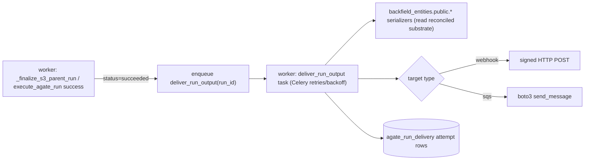

# Outbound Run Delivery (Webhook / SQS)

Design recommendation for pushing the transformed output of an Agate run to a client-controlled destination (webhook POST or SQS message). This is the **outbound counterpart** to the public read API (`docs/PUBLIC_API.md`) and the Phase 7 run trigger: the trigger lets automation *start* a run; this lets us *notify* a consumer when a run produces results.

Status: **design only** — not yet implemented. This doc captures the agreed approach so implementation can follow without re-litigating the semantics.

## Goal

When an Agate run finishes and has persisted reconciled article state, deliver the **current full representation of each affected article** to a configured destination, so an external consumer can mirror our data without polling.

## Core decisions (agreed)

1. **Deliver reconciled article *state*, not run *deltas*.** We already reconcile server-side in DBOutput (`reconciliation_policy`, default `smart_merge`: merges, retires superseded mentions, disposes orphans). Shipping raw per-run output would force the client to re-reconcile with less information and diverge from our own public API. So we ship the converged truth.

2. **Full snapshot per article — no field-level diffs / PATCH.** Each delivery is the complete current representation of one article. The client decides, field by field, whether to overwrite or ignore. We do **not** compute or send per-field diffs.

3. **Read the snapshot from substrate (the public serializers), not from `result_json`.** This is the load-bearing detail. The run's `result_json` / `stylebook_output` is built by `consolidated_body_from_dboutput` from *that run's upstream extract* — it is the run's **contribution**, not the reconciled article. Only a read-back from `substrate_*` (via `backfield_entities.public.*`) reflects the reconciliation policy. Two consequences:
   - It honors the reconciliation policy the run just applied.
   - It gives the client a clean field-level rule: *field present = current truth; field absent/null = not present in truth.* Shipping `result_json` would make the client unable to distinguish "removed by reconciliation" from "this run didn't address it."

4. **Article is the delivery key.** Keyed by stable article identity (`substrate_article.id`, plus `external_id` / `entry_id`). Re-runs and multiple flows touching the same article all upsert the **same** key. The client replaces its record; no client-side merge of our messages.

5. **Idempotent + ordered.** Two distinct properties, both required:
   - **Idempotent:** re-sending the same snapshot is a no-op (full-state overwrite). This makes the inevitable **at-least-once** delivery (Celery retries, SQS redrive, manual replay) safe.
   - **Ordered:** a newer snapshot wins; a late older one is dropped. Needed because runs finish out of order (longest-first dispatch + retries).

6. **Run-level post-stage, not an inline graph node.** Because the reconciled snapshot only exists *after* persist, delivery must run after the run finalizes — not inside `execute_graph`. A mid-graph `WebhookOutput` node only has the run delta in hand. Delivery is therefore a **finalize hook + Celery delivery task**, not a DAG node. (A node may still *configure* intent; it must not be the thing that blocks on the network send.)

### Why not bolt it onto "Backfield Output" (DBOutput)?

DBOutput already runs toggleable post-persist side effects (semantic indexing, auto-connections, etc.), so a `delivery_enabled` flag would be *mechanically* consistent. We rejected synchronous delivery there because it (a) couples third-party I/O to the persist transaction — bad next to the API lock/statement timeouts — (b) only fires when the graph persists, and (c) is still per-item. A DBOutput toggle that merely **enqueues** a delivery task is acceptable as a configuration surface, but execution stays in the post-stage.

## Versioning: two tokens, not one

A snapshot reflects **cumulative reconciled substrate at read time**, not a single story draft. Ordering by run `finished_at` alone is fragile when drafts and lanes interleave (e.g. the slow lane of an old draft finishing after the fast lane of a new draft). Carry both:

- **Story / draft identity** — `entry_id` / `update_key` / `pub_date`. "Which version of the story is this about?"
- **Monotonic processing sequence** — run `finished_at` or a per-article counter. "Which reconciliation is newer for the same draft?"

Client newest-wins rule: *higher draft identity wins; ties broken by processing sequence.*

## Multi-lane / multi-update behavior

Stories often pass through a fast lane (text, metadata) then a slow lane (places, orgs, entities), and re-run later on update. Because the snapshot is read from cumulative reconciled substrate:

- The fast-lane snapshot **carries forward** places/orgs already persisted by a prior slow-lane run — the fast lane never strips the slow lane's domains. (This would be lost if we shipped `result_json`.)
- The sequence of snapshots **converges** to the latest reconciled state.
- **Cold-start partiality** (first fast lane before any slow lane) sends empty places/orgs — that is *addition pending*, not deletion, and converges when the slow lane lands. Brief mixed-version window (v2 text + not-yet-v2 places) is acceptable eventual consistency. If a client can't tolerate it, gate delivery until the slow lane completes, or annotate which domains the snapshot covers.

## Architecture



### Components to add

- **Delivery target config** — a project-scoped `agate_delivery_target` table (or a block in `BackfieldProject.settings_json`): `type` (`webhook` | `sqs`), destination (URL / queue ARN), `enabled`, optional secret FK. A table is preferred if a project can have multiple targets or wants per-target history.
- **Secret** — webhook HMAC signing key / AWS creds stored as `BackfieldOrganizationIntegrationSecret` (existing Fernet-encrypted store; do not put secrets in graph spec JSON).
- **Delivery service** in `backfield-entities` (e.g. `backfield_entities/delivery/`) — resolve target, build the public snapshot payload, and implement transports (webhook POST, SQS send). Keep payload + transport here so it is testable without Celery.
- **Celery task** `deliver_run_output` in the worker — wraps the service, owns retries/backoff, writes attempt rows. The worker is the right home (it already does outbound I/O via boto3 in S3Output and holds long transactions).
- **Attempt log** `agate_run_delivery` — `run_id`, `target_id`, article key, `status`, `http_status` / response, `attempt_count`, timestamps. Mirrors how S3Output stamps `s3_synced_at` / `s3_sync_error`; surfaces delivery status on `GET …/runs/{run_id}` and enables a manual re-deliver (backfill) action.

### Trigger

After the `succeeded` commit in `_finalize_s3_parent_run` and the `execute_agate_run` success branch, enqueue `deliver_run_output.delay(run_id)`. **Enqueue, never call inline** — delivery failures must not roll back or block run finalization, and the read for the payload must happen after the persist transaction commits.

### Payload envelope (sketch)

```json
{
  "delivery_id": "uuid",
  "run_id": "uuid",
  "run_finished_at": "ISO-8601",
  "article": {
    "id": 211,
    "external_id": "...",
    "entry_id": "...",
    "update_key": "...",
    "pub_date": "YYYY-MM-DD"
  },
  "version": { "draft": "<entry_id/update_key/pub_date>", "sequence": "<finished_at or counter>" },
  "snapshot": { "...full public article representation (stable schema, explicit nulls)..." },
  "processing": [ { "run_id": "...", "processed_item_id": 677, "domains": ["..."] } ]
}
```

- **Stable schema, explicit nulls** (don't omit absent fields) so the client's "overwrite vs ignore" rule is unambiguous.
- **`processing[]`** reuses the full run-history list (`list_public_article_processing`) so the client sees every flow that contributed without receiving multiple contradictory payloads.
- **Webhook security:** sign the body with the per-target secret (e.g. `X-Backfield-Signature: sha256=…`).

## Reliability notes

- **At-least-once**; document it and dedupe on `delivery_id`. Full snapshots are naturally idempotent.
- **Bounded retries** with exponential backoff (Celery); record terminal failure in the attempt log.
- **Worker has no statement/lock timeout** (unlike the APIs — see `docs/OPERATIONS.md`). Keep the payload read transaction short and perform the network send **outside** any open DB transaction.
- **Partial-failure runs:** `_finalize_s3_parent_run` distinguishes `failed` vs `succeeded`. Decide per policy whether a partially-failed run delivers its successful articles.
- **Replay/backfill:** because runs persist and the payload is a read-back, a manual "re-deliver run" is just the same task re-invoked — mirror `sync_processed_item_s3_output`.

## Precedent in the codebase

- **S3Output** (`packages/backfield-agate/src/agate_nodes/s3_output/node.py`) already does state-sync per article: one current file per article, `_delete_stale_outputs_for_article` removes stale versions by `article_id` + `update_key`. It also has a re-sync task (`sync_processed_item_s3_output`). Webhook/SQS delivery should mirror its choices (state-sync, article-keyed, re-syncable) rather than inventing append/event semantics.
- **`list_public_article_processing`** (`backfield_entities/public/article_processing.py`) returns the full set of runs that touched an article (project-scoped processed-item scan), which is the source for the `processing[]` block.

## Open decisions (resolve at implementation)

1. Target storage: `agate_delivery_target` table vs `settings_json` block.
2. Delivery granularity confirmation with the client: per-article (recommended) vs an opt-in raw per-run event stream.
3. Whether to suppress delivery when the reconciled snapshot is byte-identical to the last delivered one (de-noise) vs rely on client dedupe.
4. Cold-start partiality policy: deliver fast-lane-only snapshots vs gate until slow lane completes.
5. Webhook signature scheme and required headers; SQS auth (per-target creds vs shared worker role).
