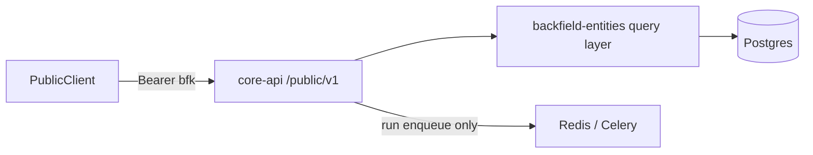

# Public API

Design reference for Backfield’s **consumer-facing HTTP surface**. This document is the source of truth for organizing principles, URL layout, and rollout phases. Implementation lives in **`apps/core-api`** under **`/public/v1`**.

For internal editorial routes (Stylebook UI, candidate review, Agate runs with review overlay), see [`API.md`](API.md). For package boundaries, see [`ARCHITECTURE.md`](ARCHITECTURE.md).

## Goals

- One **physical public API** on Core API that queries substrate and Stylebook data together.
- **Clean, consistent** routes and parameters across canonical entity types.
- Clear separation between **public**, **app/editorial**, **platform/admin**, and **utility** endpoints.
- **Read-only** query surface to start, plus a controlled **run trigger** for automation.
- Documentation that another agent can turn into an external docs site (OpenAPI + reference markdown).

## Non-goals (v1)

- Parity with any prior platform’s public routes — design for Backfield’s current schema and services.
- Full article body text in public responses.
- Public writes to Stylebook canonicals, candidate actions, or review overlay.
- Public graph editing, project admin, or org admin.

---

## Endpoint taxonomy

| Tier | Prefix / location | Auth | Purpose |
|------|-------------------|------|---------|
| **Public** | Core API **`/public/v1`** | Project API key (`bfk_…`) | Stable read queries + run trigger |
| **App / editorial** | Stylebook API `/v1`, Agate API `/v1` | Session cookie | UI workflows: canonical CRUD, candidates, review, imports |
| **Platform / admin** | Core API `/v1` (non-public) | Session or service token | Auth, org admin, AI catalog, credentials |
| **Utility** | `/health`, node metadata, runtime geocode | Varies | Ops and worker/runtime helpers — not part of public docs |

Only **`/public/v1`** routes belong in the external Public API Reference. Everything else is internal unless explicitly promoted later.

---

## Physical layout

All public routes are served by **`apps/core-api`** (port **8004** locally). Agate API and Stylebook API remain internal/editorial services; they are not alternate public hostnames.

Shared query and serialization logic should live in **`packages/backfield-entities`** (or a small sibling package if the surface grows large), not duplicated in routers. Routers validate auth, parse parameters, and call shared services.



---

## Authentication and authorization

- **Mechanism:** `Authorization: Bearer <project_api_key>` (keys issued via Core API credentials routes; prefix `bfk_`).
- **Scope:** Every public route is **project-scoped**. The key must grant access to the project in the URL (same rules as `backfield_auth.gate` project access).
- **No session cookies** on public routes.
- **Service token** (`SERVICE_API_TOKEN`) is for internal automation only — not documented as a public consumer credential.

---

## URL conventions

### Project scope

All public resources are nested under the project:

```text
/public/v1/projects/{project_slug}/…
```

`project_slug` resolves to `backfield_project`. Stylebook catalog resolution (workspace default Stylebook) is **internal** — callers do not pass `stylebook_slug` on public routes.

### Resource naming

- Use **plural product nouns** in paths: `articles`, `locations`, `people`, `organizations`, `works`, `custom-records`.
- Canonical entity ids are **UUID strings** in path segments.
- Article ids are **integers** (`substrate_article.id`).

### Query modes (per canonical type)

Each canonical type supports a **shared spine** plus type-specific filters:

| Mode | HTTP | Path pattern | Shared parameters |
|------|------|--------------|-------------------|
| **Keyword** | `GET` | `…/{type}/search` | `q`, `limit`, `offset`, type filters |
| **Entity** | `GET` | `…/{type}/{id}` | — |
| **Entity evidence** | `GET` | `…/{type}/{id}/mentions` | `limit`, `offset`, article filters |
| **Entity graph** | `GET` | `…/{type}/{id}/connections` | optional `nature`, pagination |
| **Semantic** | `POST` | `…/{type}/semantic-search` | JSON body: `query`, evidence filters |
| **Geography** | `GET` | `…/geo/…` and geo filters on search/mentions | bbox, `location_type`, `canonical_id` |

**Locations** get the richest geography surface (types list, search by type, bbox, mentions near a place). **People** and **organizations** expose geography mainly through mention/article filters (e.g. articles mentioning entities linked to a location). **Works** follow the same spine when the type is implemented.

Type-specific filter examples (non-exhaustive):

| Type | Extra keyword / list filters |
|------|------------------------------|
| Locations | `location_type`, formatted address tokens |
| People | `person_type`, `public_figure`, `title`, `affiliation` |
| Organizations | `organization_type` |
| Works | TBD when type ships |

### Pagination and sorting

- **Lists and search:** `limit` (default 25, max 100 unless noted) and `offset` (default 0).
- **Response envelope:**

```json
{
  "items": [],
  "pagination": {
    "limit": 25,
    "offset": 0,
    "total": 0
  }
}
```

- **Sort:** optional `sort` query param per resource; document allowed values per route. Default sort is stable and type-appropriate (e.g. label ascending for canonical lists, recency for mentions).

### Errors

Follow FastAPI conventions. Public routes use consistent JSON error bodies:

```json
{ "detail": "Human-readable message" }
```

- **404** when the project, article, or canonical is missing or outside the caller’s project scope (do not leak cross-project existence).
- **403** when the API key lacks project access.
- **503** when semantic search is requested but no embedding model is configured.

---

## Articles

Articles are first-class public resources (`substrate_article` + related meta). Related evidence (mentions, geography, custom records, images) uses an **article hub** layout: lean detail plus **paginated sub-routes** per slice—not a single mega-endpoint with combinatorial `include` flags.

### Article hub (organizing principle)

| Layer | Pattern | Use when |
|-------|---------|----------|
| **Detail** | `GET …/articles/{article_id}` | Headline, metadata, optional preview |
| **Sub-routes** | `GET …/articles/{article_id}/<slice>` | Heavy or paginated data: mentions, locations, custom records, images |
| **Entity-centric** | `GET …/people/{id}/mentions`, etc. | Starting from a canonical, not a story |
| **Bundle (later)** | `GET …/articles/{article_id}/bundle?sections=…` | Optional one-round-trip aggregator; not the primary contract |

Do **not** use open-ended `?include=locations,people,custom_records,images` on detail—payload size, pagination, and caching differ too much per slice. Use **sub-routes** for heavy slices.

The only supported `include` tokens on list routes are **`counts`**: a lightweight summary (mention totals by type, distinct canonical entity totals by type, image count, custom-record counts, and whether the article itself is semantically embedded). Request it on **`GET …/articles/search`**, **`GET …/articles/geo-search`**, or **`POST …/articles/semantic-search`** when you need availability signals without loading mention rows or full sub-route payloads.

On **`GET …/articles/{article_id}`**, supported `include` tokens are **`counts`** (same summary as list routes) and **`text`** (full article body in addition to the always-included preview).

### Detail (`GET …/articles/{article_id}`)

**Core fields (v1):**

- `id`, `headline`, `url`, `author`, `pub_date`, `source` (`id`, `name`)
- **`metadata`**: tags from `substrate_article_meta` (`meta_type`, `category`, `confidence`, …)
- Optional **`preview`**: short truncated snippet (max 280 characters; not full body; always included)
- **`images`**: up to 10 inline image rows (`id`, `image_id`, `url`, `caption`); use `GET …/images` when you need pagination or the full set

**Query:** `include=counts` (optional; adds `counts` and `embedded`); `include=text` (optional; adds full body in `text` alongside `preview`).

**Optional `counts` block** (when `include=counts`):

- `mentions`: non-deleted mention row totals by type (`locations`, `people`, `organizations`, `total`)
- `entities`: distinct Stylebook canonical totals by type (uncanonicalized mentions excluded)
- `images`: total image count for the article
- `custom_records`: map of record type → count
- `embedded`: `true` when the article has a populated `substrate_article_embedding` row

### Excluded from detail

- Full **`text`** / body
- Mention rows, geometry, custom record payloads (use sub-routes)
- Internal overlay state and other Agate execution internals unless a support contract requires them

### Article sub-routes (primary pattern for rich context)

All paths are under `…/projects/{project_slug}/articles/{article_id}/…`. Shared pagination: `limit`, `offset`. Returns **404** when the article is missing or not in the project.

| Method | Path | Purpose |
|--------|------|---------|
| `GET` | `…/mentions` | All mention evidence across entity types for one article |
| `GET` | `…/metadata` | Metadata rows and distinct types for this article |
| `GET` | `…/locations` | Geography-focused: places in the story with canonical + geometry where available |
| `GET` | `…/custom-records` | Custom Extract rows for this article |
| `GET` | `…/images` | Images attached to the article (`substrate_image`) |

**`GET …/mentions`** — unified index for “who/what is mentioned?”

- Query: `entity_type` optional filter (`location`, `person`, `organization`); `nature` exact match; `quote=true` for quoted evidence only
- Each row: entity type, label, optional `nature` / `role_in_story`, optional canonical summary, optional evidence (`mention_text`, `quote`, character offsets)
- Returns all matching mentions (not paginated); does not return full article body

**`GET …/locations`** — map-oriented view (may overlap mentions but different shape)

- Resolved Stylebook canonical fields where linked
- Geometry / formatted address when present
- Paginated list of location mentions or deduplicated places (exact dedupe rules documented at ship time)

**`GET …/custom-records`** — see [Custom records](#custom-records) (same response shape as project search, scoped to one article).

**`GET …/images`** — `image_id`, `url`, `caption` from `substrate_image`.

**Future (non-primary):** `GET …/bundle?sections=locations,custom_records,images` composes the above for clients that need one round trip; implemented as a thin aggregator over sub-route query helpers.

### Article list / search

| Method | Path | Purpose |
|--------|------|---------|
| `GET` | `…/articles/search` | Keyword search + metadata filters + date range |
| `GET` | `…/articles/facets` | Distinct authors, sources, and preset metadata categories for filter dropdowns |
| `GET` | `…/articles/metadata/types` | Distinct metadata types attached to articles in the project |
| `GET` | `…/articles/metadata/types/{meta_type}/values` | Distinct category values for one metadata type |
| `POST` | `…/articles/semantic-search` | Natural-language search over embedded articles |
| `GET` | `…/articles/geo-search` | Articles with location mentions near a point or in a bbox |
| `GET` | `…/articles/geo-cells` | H3 hex cells with distinct-article counts for a bbox (map coverage) |
| `GET` | `…/articles/geo-cells/{h3_cell}` | Articles and in-cell location mentions for one coverage hex (drill-down) |
| `POST` | `…/articles/geo-cells/query` | Batch drill-down for many hexes (deduplicated articles + `matched_cells`) |
| `GET` | `…/articles/{article_id}` | Article detail |

**Search parameters** (shared across article keyword search, semantic search, geo search, geo cells, and project-wide mention search):

- `q` — keyword (headline, body text, URL); on PostgreSQL, full-text search with web-style syntax: quoted phrases (`"city council"`), `OR`, and `-` exclusions; unquoted terms are ANDed (**keyword search only**)
- `meta_type`, `meta_category` — include articles matching `substrate_article_meta` (single clause; legacy)
- `exclude_meta_type`, `exclude_meta_category` — exclude articles with matching metadata rows (legacy)
- `meta` — advanced metadata clauses (AND across clauses). On **GET** routes, repeat the query param; on **POST** routes (`semantic-search`, `geo-cells/query`), pass a JSON string array. Forms: `type`, `type:category`, `type:cat1|cat2` (OR within type), `!type` or `!type:category` (negation). Repeat a type to require all listed categories. Max 25 clauses; max 50 categories per clause.
- `section` — shorthand for `meta=topic:<value>`
- `pub_date_from`, `pub_date_to` — ISO dates (`YYYY-MM-DD`)
- Standard pagination

**Keyword search (`GET …/articles/search`):** response echoes effective query filters (`q`, metadata, author, source, dates, etc.) at the top level, then paginated **`items[]`** in the standard article list shape. Optional **`include=counts`**.

**Semantic search (`POST …/articles/semantic-search`):**

- `query` — natural-language search text (required JSON body field)
- `use_hyde` (default `false`) — when `true`, generate a hypothetical news passage from the query with the project/org **`generative.default`** model (or the sole enabled generative model), embed that passage, and rank articles against it
- Embeds the query (or HyDE passage) with the project/org default **`semantic.embedding`** model
- Ranks only articles with a matching **`substrate_article_embedding`** row (same model config, or legacy rows matched by provider model id)
- Supports the same metadata and date filters as keyword search
- **`items[]`** use the same article list shape as keyword search (`preview`, `metadata`, optional `include=counts` for `embedded` and hub totals) plus **`score`** per row
- Returns embedding model metadata; when HyDE is used, echoes **`hyde_used`**, **`hypothetical_document`**, and HyDE model metadata
- **503** when no embedding model is configured, or when `use_hyde` is `true` but no generative model is available

**Geo search (`GET …/articles/geo-search`):**

- **Point mode:** `center_lng`, `center_lat`, `radius_miles` — articles with at least one location mention whose geometry falls within the radius
- **Bbox mode:** `bbox=min_lng,min_lat,max_lng,max_lat` — articles with location mentions inside the box
- Optional repeatable `location_type` (OR — match any listed type), `nature`, metadata, and date filters (same as keyword search)
- Response echoes the geographic query (`search_mode`, point/bbox coordinates, filters) plus paginated **`items[]`**
- Each item uses the same article list shape as keyword search plus **`matching_locations`** (the location mentions that satisfied the geo filter)
- Optional **`include=counts`** for hub totals and `embedded` (same as keyword search)

**Geo cells (`GET …/articles/geo-cells`):**

- **Bbox mode (required):** `bbox=min_lng,min_lat,max_lng,max_lat`
- Returns **`resolution`** (effective after auto-coarsen), **`derived_resolution`**, optional **`requested_resolution`**, **`bbox_extent_km`**, **`coarsened`**, and **`cells[]`** with `h3_cell` + **`article_count`** (distinct articles per cell)
- **Size gate:** locations with native `h3_resolution < R` are excluded at fine zoom — coarse city/state mentions do not pollute block-level counts; no type-based configuration required
- Optional `resolution` (honored as starting resolution; auto-coarsened if cell ceiling exceeded), plus `location_type`, `nature`, metadata, and date filters (same as geo search)
- Capped at 5,000 cells per response via auto-coarsen

**Geo cell drill-down (`GET …/articles/geo-cells/{h3_cell}`):**

- Pass the `h3_cell` from a coverage response; `resolution` is derived from the cell ID
- Returns `h3_cell`, `resolution`, paginated `items[]` (article + `matching_locations`), and `pagination.total`
- `pagination.total` should match the cell's `article_count` when the same filters are forwarded
- Valid but empty cells return `200` with `total: 0`

**Batch geo cell drill-down (`POST …/articles/geo-cells/query`):**

- JSON body with `cells[]` and shared `resolution`, plus the same mention/metadata/date filters as single-cell drill-down and optional `external_source`
- Returns deduplicated `items[]` with `article`, `matching_locations`, and `matched_cells`; global pagination over the merged set
- Includes `per_cell_totals[]` for cross-checking coverage counts
- Cap: 200 cells per request. See [`docs/batch-geo-cells-query-spec.md`](batch-geo-cells-query-spec.md)

See [`docs/public-api/reference/geo-cells-map-clients.md`](public-api/reference/geo-cells-map-clients.md) for map-client integration guidance.

### Two valid entry points

- **Story-first:** article detail → sub-routes (`/articles/{id}/mentions`, …)
- **Entity-first:** canonical detail → `/people/{id}/mentions` (etc.)
- **Mention-first:** project-wide search → `/mentions/search`, `/mentions/facets`, `/mentions/{entity_type}/{mention_id}`

Sub-routes and entity-centric routes share query helpers in `backfield-entities`; only URL shape and default filters differ.

### Project-wide mentions (cross-article)

All paths are under `…/projects/{project_slug}/mentions/…`. Returns **404** when a mention is missing or not in the project.

| Method | Path | Purpose |
|--------|------|---------|
| `GET` | `…/mentions/search` | Unified keyword + filter search across location, person, and organization mentions |
| `GET` | `…/mentions/facets` | Distinct entity types, natures, and type values for filter dropdowns |
| `GET` | `…/mentions/{entity_type}/{mention_id}` | Single mention with full occurrence evidence and article context |

**Search parameters** mirror article search where applicable (`author`, `external_source`, `section`, metadata include/exclude, `pub_date_from`/`pub_date_to`), plus mention-specific filters: `entity_type`, `q` (entity name), `nature`, `has_canonical`, `location_type`, `person_type`, `organization_type`, `public_figure`.

Results are ordered by article `pub_date` descending (nulls last), then mention id descending. Search rows include first-occurrence evidence; detail returns all non-suppressed occurrences.

---

## Canonical entities (Stylebook + substrate)

Public responses expose the **resolved editorial view**: Stylebook canonical fields, mention counts, and evidence rows joined from substrate — not open candidate queues or raw ingest policy blobs.

### Shared detail shape (conceptual)

- Canonical identity: `id`, `slug`, `label`, type-specific fields
- **`mention_count`** (project scope, non-deleted mentions)
- **`story_count`** (people detail only: distinct articles with at least one mention — use `GET …/people/{id}/articles` for a deduped story list; `GET …/people/{id}/mentions` returns passage-level rows and may repeat the same article)
- Links to **Stylebook meta** and **connections** where applicable

### Routes (per type `{type}` = `locations` | `people` | `organizations` | `works`)

| Method | Path | Purpose |
|--------|------|---------|
| `GET` | `…/{type}` | List all (people only in v1; alias of search with no query) |
| `GET` | `…/{type}/search` | Keyword / filter search |
| `GET` | `…/{type}/types` | Distinct type values for filters (people in v1) |
| `GET` | `…/{type}/{id}` | Canonical detail |
| `GET` | `…/{type}/{id}/mentions` | Paginated mention evidence |
| `GET` | `…/{type}/{id}/articles` | Paginated articles mentioning the canonical |
| `GET` | `…/{type}/{id}/connections` | Stylebook connections |
| `POST` | `…/{type}/semantic-search` | Natural-language mention search |

**Works:** return **501** or omit routes until `work` entity HTTP is implemented; document in the capability matrix.

---

## Custom records

Custom Extract output (`substrate_custom_record`) is part of the public API.

### Response shape

- `id`, `article_id`, `record_type`, `record_index`
- `fields` — parsed from `fields_json`
- `mentions` — parsed from `mentions_json` (evidence spans; no full article body)
- `field_schema` — from `field_schema_json` (so consumers can interpret historical rows)
- Optional `confidence`

### Routes

| Method | Path | Purpose |
|--------|------|---------|
| `GET` | `…/custom-records/search` | Filter by `record_type`, field values, `article_id`, date, keyword |
| `GET` | `…/articles/{article_id}/custom-records` | All records for one article |
| `GET` | `…/custom-records/{record_type}/{record_index}` | Single record (composite key within article) |

Field-value search semantics (equals vs contains) should be documented per field type in the reference; v1 can start with equality on string fields and exact `record_type`.

---

## Geography (cross-cutting)

Geography routes combine substrate geometry and Stylebook canonicals:

| Method | Path | Purpose |
|--------|------|---------|
| `GET` | `…/geo/location-types` | Distinct location types in project |
| `GET` | `…/geo/locations/search` | Search canonical/substrate locations by type + keyword |
| `GET` | `…/geo/locations/{id}/mentions` | Mentions linked to a location (with optional article meta filters) |

Article and entity list routes may accept optional **`location_id`** or **`bbox`** parameters where joins are defined in the query layer.

---

## Run trigger (exception to read-only)

Automation may **start an Agate run** without using session-based Agate API routes.

### Principles

- **Opt-in graphs:** only graphs explicitly marked **`public_run_enabled`** (new graph or project flag — exact storage TBD in Phase 1) may be triggered via the public API.
- **Input injection:** request body supplies parameters mapped to **ingress nodes** (TextInput, JSONInput, or a documented subset of S3Input batch parameters).
- **Same worker path** as `POST /runs` on Agate API (enqueue Celery; no duplicate execution engine).
- **Poll-only follow-up** on public API — no cancel, rerun, or review overlay.

### Routes

| Method | Path | Purpose |
|--------|------|---------|
| `POST` | `…/runs` | Start a run |
| `GET` | `…/runs/{run_id}` | Run status + minimal item summary |

**POST body (conceptual):**

```json
{
  "graph_id": "uuid-or-slug",
  "inputs": {
    "<ingress_node_id_or_alias>": { "text": "…" }
  }
}
```

Exact ingress mapping rules (node id vs stable alias, JSONInput shape) are specified during Phase 1 implementation. Public run responses omit internal cost breakdowns unless needed for billing integrations.

---

## Documentation for an external docs site

Maintain two artifacts in-repo (paths may shift; keep content in sync with code):

1. **OpenAPI** — FastAPI schema for `/public/v1` only (tagged `public-*`). Export via `GET /openapi.json` filtered or a dedicated export script.
2. **`docs/public-api/reference/`** — agent-ready markdown tree:
   - `README.md` — taxonomy, auth, pagination, error model
   - **`endpoints.md`** — **running list** of shipped routes (module path, parameters, responses, errors); update on every new endpoint
   - `capability-matrix.md` — which query modes exist per type and phase
   - `articles.md`, `locations.md`, `people.md`, … — route pages with parameters and example JSON
   - `runs.md` — run trigger contract

Another repo’s docs agent should be able to ingest **`reference/` + OpenAPI** without reading Stylebook or Agate internal route docs.

---

## Relationship to existing services

| Concern | Owner today | Public API approach |
|---------|-----------|---------------------|
| Article substrate | Worker / DBOutput | Read via core-api query layer |
| Stylebook canonicals | stylebook-api (editorial) | Read via core-api; writes stay internal |
| Semantic mention search | stylebook-api (POST, session) | Re-home read logic to shared layer; expose on public router |
| Run execution | agate-api `POST /runs` | Public POST delegates to shared enqueue helper |
| Project API keys | core-api credentials | Same keys for public consumers |

Internal Stylebook and Agate routes **do not move** in v1; public API **adds** a new surface rather than renaming editorial paths.

---

## Implementation plan

Work on branch **`feat/api-surface`** (or child branches per phase). Update this doc when routes ship or contracts change.

### Phase 0 — Design lock ✅

- [x] Organizing doc (this file)
- [ ] Review and sign off on URL layout, run-trigger rules, and capability matrix

### Phase 1 — Foundation

**Goal:** Empty but real public surface with auth, project scope, and doc export.

- [x] Add `core_api/routers/public/` package mounted at **`/public/v1`**
- [x] Project API key dependency (reuse `backfield_auth.gate` project key path)
- [x] Shared helpers: pagination envelope, project + stylebook resolution, OpenAPI tags
- [x] `GET /public/v1/projects/{project_slug}` — project metadata (name, slug, Stylebook) plus substrate summary stats (articles, mentions, images, semantic indexing counts)
- [x] Running endpoint registry: **`docs/public-api/reference/endpoints.md`**
- [ ] Decide storage for **`public_run_enabled`** on graphs
- [x] Scaffold `docs/public-api/reference/README.md` and `capability-matrix.md`
- [x] Tests: auth, wrong project, 404 semantics

**Validation:** `make lint`, `make test`

### Phase 2 — Articles (tracer bullet)

**Goal:** Prove substrate queries and documentation shape.

- [x] `GET …/articles/search` — keyword, meta filters, date range
- [x] `GET …/articles/{article_id}` — detail with preview; optional `include=text` for full body
- [x] Registry entries in **`docs/public-api/reference/endpoints.md`**
- [x] Indexes: existing `substrate_article` / `substrate_article_meta` indexes cover v1 filters

**Validation:** `make lint`, `make test`, targeted integration tests

### Phase 2b — Article hub slices

**Goal:** Rich article context via sub-routes (not combinatorial `include` on detail).

- [x] `GET …/articles/{article_id}/mentions` — all mentions; optional `entity_type`, `nature`, `quote`
- [x] `GET …/articles/{article_id}/locations` — geography / map-oriented shape
- [x] `GET …/articles/{article_id}/images`
- [x] Registry entries in **`endpoints.md`** for each shipped sub-route
- [x] Shared mention/location serializers in `backfield_entities.public.*`

**Validation:** `make lint`, `make test`

### Phase 3 — Custom records

**Goal:** Expose Custom Extract persistence publicly.

- `GET …/custom-records/search`
- `GET …/articles/{article_id}/custom-records`
- Reference page; field-type search semantics documented

**Validation:** `make lint`, `make test`

### Phase 4 — Canonical types (keyword + entity)

**Goal:** Consistent per-type search and detail.

Order by maturity:

1. **Locations** — search, detail, mentions, connections
2. **People** — same spine
3. **Organizations** — same spine
4. **Works** — stub or skip until entity type ships

Extract shared “canonical query” module in `backfield-entities` to avoid copy-paste across types.

- [x] Project-wide mention search, facets, and detail — `GET …/mentions/search`, `GET …/mentions/facets`, `GET …/mentions/{entity_type}/{mention_id}`

**Validation:** `make lint`, `make test`

### Phase 5 — Semantic search

**Goal:** Public natural-language mention search.

- `POST …/{type}/semantic-search` for people and locations (organizations when embeddings exist)
- Reuse embedding model resolution from existing semantic indexing config
- **503** when embedding model missing

**Validation:** `make lint`, `make test`; optional stack test when embeddings configured

### Phase 6 — Geography

**Goal:** Cross-cutting geo queries and location-scoped filters on articles/mentions.

- `GET …/geo/location-types`
- `GET …/geo/locations/search`
- Optional bbox / `location_id` filters on article and mention routes

**Validation:** `make lint`, `make test`

### Phase 7 — Run trigger

**Goal:** Controlled automation entrypoint.

- Shared enqueue helper callable from agate-api and core-api public router
- `POST …/runs`, `GET …/runs/{run_id}` (minimal public run shape)
- Graph allowlist (`public_run_enabled`)
- Document ingress `inputs` mapping
- Reference page `runs.md`

**Validation:** `make lint`, `make test`, `make smoke` when run path touches worker enqueue

### Phase 8 — Docs handoff

**Goal:** External docs repo can generate the site.

- Export script for public OpenAPI subset
- Complete `docs/public-api/reference/` route pages
- Capability matrix reflects shipped phases
- Short “integration guide” (auth, rate limits TBD, pagination worked example)

---

## Capability matrix (target)

Update as phases complete. **Shipped** / **Planned** / **N/A**.

| Resource | Keyword | Entity detail | Mentions | Connections | Semantic | Geo filters |
|----------|---------|---------------|----------|-------------|----------|-------------|
| Articles (core) | ✅ | ✅ | — | — | — | — |
| Articles (hub) | — | — | ✅ | — | — | ✅ |
| Article images | — | ✅ | — | — | — | — |
| Custom records | Planned | Planned | — | — | — | — |
| Locations | ✅ | ✅ | ✅ | ✅ | Planned | ✅ |
| People | ✅ | ✅ | ✅ | ✅ | Planned | Partial |
| Organizations | ✅ | ✅ | ✅ | ✅ | Planned | Partial |
| Works | N/A | N/A | N/A | N/A | N/A | N/A |
| Runs (trigger) | — | Planned | — | — | — | — |

---

## Open decisions (resolve in Phase 1)

1. **Graph public flag:** column on `agate_graph` vs project-level allowlist table.
2. **Ingress mapping:** node React Flow id vs declared stable alias in graph metadata.
3. **Article preview:** max characters and whether to index preview for search.
4. **Rate limiting:** defer to gateway vs middleware in core-api.
5. **Custom record search:** which field types support substring vs exact match in v1.

**Resolved (Phase 2):** article preview uses **280 characters** max (`PUBLIC_ARTICLE_PREVIEW_MAX_LEN` in `backfield_entities.public.articles`).

**Resolved (article hub):** use **lean detail + paginated sub-routes** (`/mentions`, `/locations`, `/custom-records`, `/images`); optional `/bundle` later—not combinatorial `include` for heavy slices.
